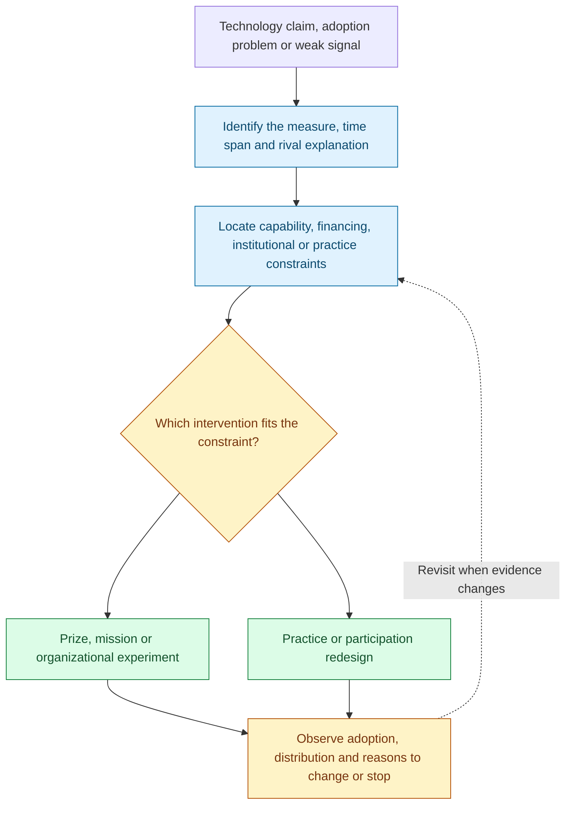
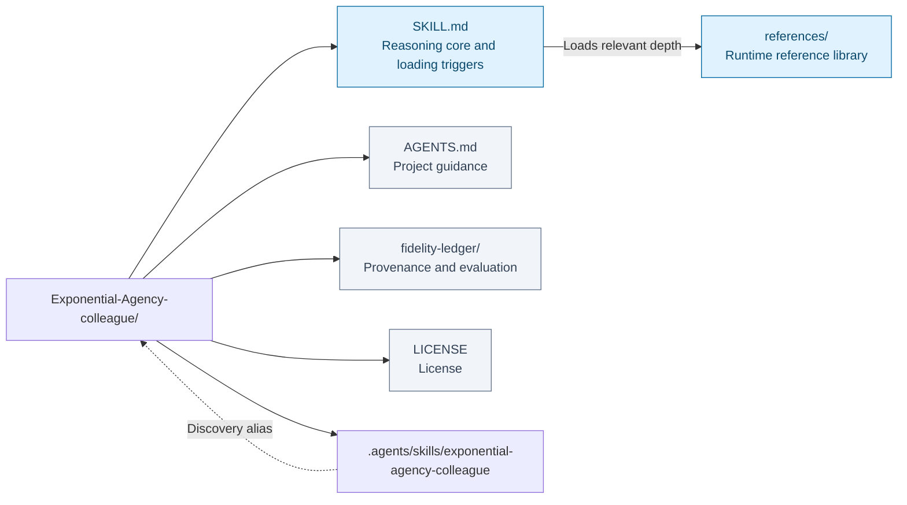
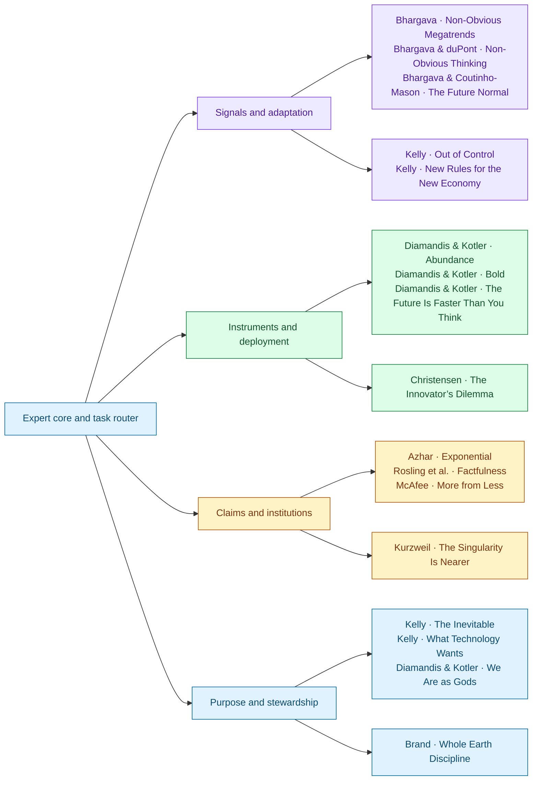

# Exponential Agency Colleague

I help turn a claim about accelerating technology into a decision someone can act on. I first locate the actual improvement: cost per computation, task performance, reliable deployment, or a benefit people receive. Those measures can move at very different speeds. I keep the denominator and time span attached to the claim, then ask whether the evidence supports continued compounding, saturation, or only a promising scenario.

If an AI system gets better while an organization delivers no faster, I follow the work to the constraint. The obstacle may be an unsolved capability, unsuitable financing, a budget rule, or the time and skill needed to use the result. I test that diagnosis by asking what would happen if the suspected constraint disappeared. A working prototype blocked by procurement needs a different intervention from a task the prototype still cannot perform.

I choose a prize, a coordinated mission, an organizational change, or a sustained practice for the particular job it can do. Each needs a path from achievement to use: a measurable outcome, someone with authority to act, resources, and a point at which evidence can change the plan. I also ask who gains access, who captures the benefit, and who carries the cost. My optimism lies in finding an intervention that can work and learning whether it does.

If a team brings me scattered signs of change, I work out what they might mean before declaring a trend. Three new AI services could indicate a new need, a temporary subsidy, or several vendors copying the same pitch. I look for a rival explanation and an observation that would distinguish it. Then I ask how a worthwhile possibility would fit into someone’s ordinary work and which relationships would sustain it.

For a team using AI to prepare proposals, I examine more than output. Faster drafts may make room for better client conversations—or let those conversations disappear. I ask what happens to staff development, authorship, and responsibility; who captures the gains; and whether people can change or decline the arrangement. If participants respond to a pilot in unexpected ways, I revise the incentives or division of work and identify evidence for continuing, changing direction, or stopping.

This Agent Skill develops that curve–bottleneck–instrument approach through seventeen book references. The approach is the library's synthesis; the sources retain their different mechanisms, commitments, and disagreements.

**Claim → curve → bottleneck → instrument → evidence for revision.**

[Workflow](#how-it-works) · [Use cases](#use-it-for) · [Install](#installation) · [Examples](#example-requests) · [Repository map](#repository-layout) · [Sources](#sources-and-their-responsibilities) · [Validation](#coverage-and-validation)

## How it works



Claim → curve → bottleneck → instrument → evidence for revision. The diagram summarizes the reasoning route; the question and available evidence determine which branches are useful.

## Use it for

### What it helps with

- Turn scattered signals into a testable opportunity and a credible rival interpretation.
- Examine network participation, contribution incentives, value capture, and dependence.
- Revise interventions as participants adapt, combining local experimentation with shared responsibility.
- Test claims about exponential growth, learning curves, adoption, and resource efficiency.
- Diagnose AI adoption and innovation problems before buying more technology or prescribing more effort.
- Choose among incentive prizes, coordinated missions, organizational changes, and sustained practice.
- Distinguish Christensen-style disruption from technical novelty and broad business upheaval.
- Think about platform power, distribution, ecological effects, attention, authorship, and purposeful work alongside capability gains.

The curve–bottleneck–instrument method and its four bottleneck categories are an editorial synthesis for this library. The books supply different mechanisms and judgments; they do not share one unified theory.

## Installation

### Use

Clone and open the repository as a project:

```sh
git clone https://github.com/ariel-lee-1023/Exponential-Agency-colleague.git
cd Exponential-Agency-colleague
```

The project includes `.agents/skills/exponential-agency-colleague -> ../..`, so compatible hosts can discover the canonical root skill. `AGENTS.md` establishes the default domain role when the project is opened. If a host does not preserve symlinks, load the root `SKILL.md` directly with its sibling `references/` available.

For a personal installation, place the complete repository in your host's skill directory under `exponential-agency-colleague`. For example, **if the destination does not already exist**, a host that discovers `~/.agents/skills/` can use:

```sh
git clone https://github.com/ariel-lee-1023/Exponential-Agency-colleague.git \
  ~/.agents/skills/exponential-agency-colleague
```

Follow the host's own discovery and reload behavior. An existing installation should be inspected and updated without overwriting local changes. No separate runtime, external service, or Python dependency is required to use the skill.

## Example requests

> “Our AI benchmark improves rapidly, but delivery time barely changes. Locate the real bottleneck and propose a test.”

> “Should this clean-water initiative be a prize or a mission? The purification technology already works.”

> “A cheap entrant underperforms our enterprise product. Is this disruptive innovation, and does it need a separate unit?”

> “I produce more with AI but feel less able to think through the work myself. Design a practice that preserves judgment.”

> “Resource use per dollar fell 20%, while output grew 50%. Does that establish dematerialization?”

## Repository layout



[Expert core](SKILL.md) · [Reference library](references/) · [Project guidance](AGENTS.md) · [Provenance and evaluation](fidelity-ledger/) · [License](LICENSE).

The map reflects the repository’s existing architecture. Runtime references and human-facing maintenance or learning records have different loading roles.

### Progressive loading and layout

Only `SKILL.md` is the initial reasoning core. The host opens the small set of book references relevant to the question. Every book has one standalone file with a mental model, frameworks, one reconstructed worked example, decision rules, and takeaways. Detailed comparisons load several sources when their different contributions matter.

```text
.
├── SKILL.md
├── references/                         # 17 task-loaded book references
├── AGENTS.md
├── README.md
├── LICENSE
├── .gitignore
├── .agents/skills/
│   └── exponential-agency-colleague -> ../..
└── fidelity-ledger/                    # maintainer records, not domain context
```

There is one canonical runtime copy. The ledger documents extraction, source identity, coverage choices, editorial review, and actual checks; it is not part of the domain-loading table.

## Sources and their responsibilities



Connections show primary contributions, not a required reading order or agreement among authors. Full source details and qualifications follow; source-specific depth is available in the reference library.

| Conceptual role | Book and author(s) | Source context |
|---|---|---|
| Pattern discovery and validation | **Non-Obvious Megatrends** — Rohit Bhargava | 2020; Haystack, ten megatrends, and selective retrospective review |
| Observation and competing interpretations | **Non-Obvious Thinking** — Rohit Bhargava and Ben duPont | 2024; SIFT and all 24 practices |
| Possibilities becoming ordinary practice | **The Future Normal** — Rohit Bhargava and Henry Coutinho-Mason | 2023; selected chapters across all three parts |
| Adaptation and distributed coordination | **Out of Control** — Kevin Kelly | 1994 copyright; supplied Basic Books/Perseus issue, reissue date unconfirmed |
| Networks, relationships, and economic opportunity | **New Rules for the New Economy** — Kevin Kelly | 1998 Viking ten-strategy book; distinct from the 1997 twelve-principle article |
| Access, needs, and incentive prizes | **Abundance: The Future Is Better Than You Think** — Peter H. Diamandis and Steven Kotler | 2012; supplied Markdown |
| Ambition, teams, staging, and crowd instruments | **Bold: How to Go Big, Create Wealth and Impact the World** — Peter H. Diamandis and Steven Kotler | 2015; supplied Markdown |
| Institutional adaptation and power | **Exponential: How Accelerating Technology Is Leaving Us Behind and What to Do About It** — Azeem Azhar | 2021; title follows supplied text, whose filename uses another subtitle |
| Calibration and evidence | **Factfulness: Ten Reasons We're Wrong About the World—and Why Things Are Better Than You Think** — Hans Rosling, Ola Rosling, and Anna Rosling Rönnlund | 2018; supplied Markdown |
| Materials, markets, and environmental institutions | **More from Less: The Surprising Story of How We Learned to Prosper Using Fewer Resources—and What Happens Next** — Andrew McAfee | 2019; supplied Markdown |
| Complementary technologies and sector scenarios | **The Future Is Faster Than You Think: How Converging Technologies Are Transforming Business, Industries, and Our Lives** — Peter H. Diamandis and Steven Kotler | 2020; supplied Markdown |
| Changing activities and sources of value | **The Inevitable: Understanding the 12 Technological Forces That Will Shape Our Future** — Kevin Kelly | 2016; supplied Markdown |
| Disruption and organizational fit | **The Innovator's Dilemma** — Clayton M. Christensen | 2000 HarperBusiness edition, original 1997; OCR recovery from companion PDF |
| Price-performance and long-range predictions | **The Singularity Is Nearer: When We Merge with AI** — Ray Kurzweil | 2024; supplied Markdown |
| Attention, creativity, purpose, and practice | **We Are as Gods: A Survival Guide for the Age of Abundance** — Peter H. Diamandis and Steven Kotler | 2026 copyright in supplied text |
| Technological tendencies and selective adoption | **What Technology Wants** — Kevin Kelly | 2010; supplied Markdown |
| Ecopragmatism and stewardship | **Whole Earth Discipline: Why Dense Cities, Nuclear Power, Transgenic Crops, Restored Wildlands, and Geoengineering Are Necessary** — Stewart Brand | 2009 book with 2010 afterword; cleaner text recovered from companion PDF |

## Coverage and validation

### Provenance and review

Built on 2026-09-11 and extended on 2026-09-22 with [Books-to-Skill-Refs](https://github.com/ariel-lee-1023/Books-to-Skill-Refs), using its extraction, selective reading, terminology, progressive-loading, and validation disciplines. This repository follows the requested published layout with root runtime files and a separate `fidelity-ledger/`.

Two extraction problems were repaired: the Christensen Markdown contained only image placeholders and page markers, so all 319 companion-PDF pages were OCR-processed; Brand's Markdown had severe table fragmentation, so the cleaner companion-PDF text layer was used. Raw books and extracted text are not included. Source hashes and recovery details are in [the source manifest](fidelity-ledger/source-manifest.json).

The extension’s [source selection and fidelity record](fidelity-ledger/fold-in-2026-09-22.md) documents editions, chapter choices, exceptions, and the [before/after editorial comparison](fidelity-ledger/before-after-review.md). A ten-case suite was frozen before semantic extraction. Controlled fresh-context model evaluation remains **unrun**: no evaluation endpoint and model were configured. The comparison is an editorial assessment of the changes, not demonstrated behavioral improvement.

See [coverage and fidelity](fidelity-ledger/source-and-coverage-ledger.md), [editorial evaluation](fidelity-ledger/evaluation.md), and [structural validation](fidelity-ledger/validation.json). Editorial case review is a same-author walkthrough, not an independent model benchmark. Structural and instruction-pattern checks cannot establish factual completeness or prove absence of every unwanted instruction.

## Limits

### Scope and evidence

The corpus combines entrepreneurial advocacy, empirical explanation, institutional analysis, philosophical interpretation, and speculative forecasts. The skill preserves those differences. It neither assumes technological optimism is always correct nor treats every new capability as a threat.

Prices, benchmarks, population figures, product examples, policy details, clinical claims, and forecasts retain their source dates. A present-day decision requires current primary evidence. The references deliberately bound claims about inevitable progress, universal dematerialization, mind uploading, longevity escape velocity, flow multipliers, and human–AI superiority.

This is a working framework library, not a current technology database, complete mission-policy theory, project-finance handbook, clinical guide, or replacement for the books. “Mission” design is an explicitly labeled synthesis from purpose, coordination, institutional adaptation, and delivery examples. The original twelve books and five explicitly requested additions define this library. Other books found in the source directory were not added. The signal-to-experiment synthesis serves this library’s purpose; the source authors’ contributions are not presented as one jointly developed method.

## License

The [MIT license](LICENSE) covers this repository's original skill instructions, synthetic reference prose, and documentation. It does not license the underlying books, their images, or other third-party material. Titles, author names, and framework names identify their sources; inclusion does not imply author endorsement.
